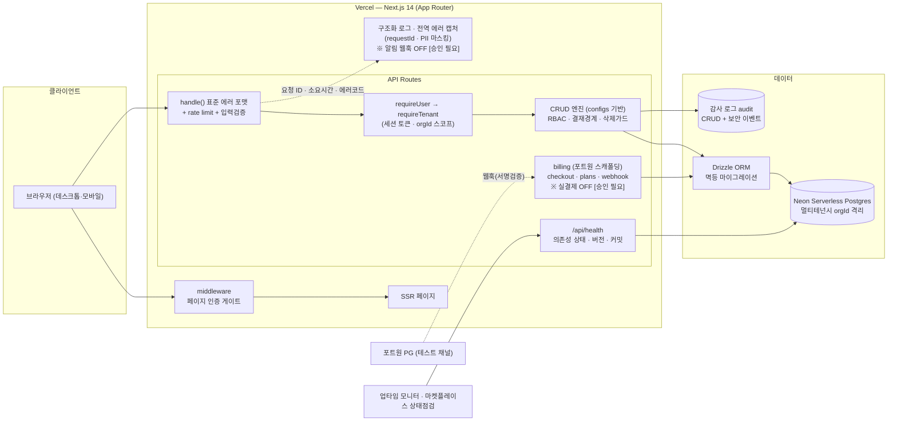

# PRISM PMS — 클라우드 마켓플레이스 제출자료 (초안)

> 상태: **[승인 필요]** — 마켓플레이스(예: AWS Marketplace / 네이버클라우드 / 토스페이먼츠 스토어 등) 제출 전 대표·법무 검토 필요.
> 최종 갱신: 2026-09-16 · 버전 0.12.0 · 작성: 자동 상용화 패스(2026-07-24 초안 → 2026-09-16 상용 필수 항목 반영 갱신)

---

## 1. 서비스 개요

**PRISM PMS**는 프로젝트·일정·요구사항·품질을 하나로 묶는 통합 프로젝트 관리(Project Management System) SaaS입니다. SI/SM 프로젝트, 사내 개발조직, 공공/금융 프로젝트의 산출물 관리와 진척 추적에 최적화되어 있습니다.

한 줄 소개: **"WBS·간트·요구사항추적·전자결재·EVM 성과관리까지, 실무에 필요한 PMS 전부를 하나로."**

대상 고객: SI/SM 수행사, 사내 IT 프로젝트 조직, 공공기관 정보화 사업 수행팀, 중견 개발조직(5~200인).

## 2. 주요 기능

프로젝트·단계(Phase)·요구사항(+RTM 추적 매트릭스)·이슈/결함·리스크·업무(WBS 계층 1·1.1)·산출물(+전자결재)·회의·인터페이스·인프라·방화벽·조달·멤버/권한·게시판·스프린트를 표준 도메인으로 제공합니다.

성과관리는 EVM(PV·EV·AC·SV·SPI·CPI)을 공수 기반으로 산출하며, 인터랙티브 간트(베이스라인·의존성 드래그·임계경로·스와임레인), 칸반, 통합 캘린더, 내 작업/주간보고/업무부하 뷰를 함께 제공합니다. 테스트 관리는 개발→PL→PM 파이프라인과 차수(Cycle)·실행 리포트(통과율·실패·검증단계)를 지원합니다.

편의성은 monday.com 벤치마킹으로 상태 색상 바, 다중선택 일괄작업, 인라인 편집, 하단 빠른추가, 컬럼 표시/숨김, 풀셀 컬러태그, ⌘K 전역검색을 제공하며, 모바일 하단 탭바와 44px 터치 타깃으로 반응형을 보장합니다.

## 3. 시스템 아키텍처

| 계층 | 기술 | 비고 |
|---|---|---|
| 프런트엔드/서버 | Next.js 14 (App Router, React) | SSR + API Routes 단일 코드베이스 |
| ORM | Drizzle ORM | 타입세이프 스키마·멱등 마이그레이션(MIGRATION_DDL) |
| 데이터베이스 | Neon (Serverless Postgres) | 멀티테넌시(orgId 스코프), 인덱스 최적화 |
| 배포/호스팅 | Vercel | 무인 자동 배포 + 자동 마이그레이션(ensureSchema) |
| 인증/세션 | 세션 토큰(sessions 테이블, 인덱스) · scrypt 비밀번호 해시 | RBAC 역할→권한 매핑, `middleware.ts` 페이지 인증 게이트 |
| 관측(로깅·모니터링) | 구조화 로그(`lib/logger.ts`) · 전역 에러 캡처 · 알림 웹훅 | 요청 ID·소요시간·에러코드 기록, PII 필드 마스킹. DSN·웹훅 미설정 시 no-op |
| 품질 게이트 | GitHub Actions CI(`.github/workflows/ci.yml`) | typecheck + 테스트·커버리지 임계값(`src/lib/**` lines 90·branches 80·funcs 85) 미달 시 실패 |

요청 처리 표준: 모든 API는 `handle()` 래퍼로 표준 에러 포맷(`{ ok, code, message }`)과 Postgres 에러코드 매핑(23505/23503/23502/22P02/23514)을 거치며, 요청마다 `x-request-id` 를 발급·응답해 로그와 대조할 수 있습니다. 입력은 필드명 규약 기반 공통 검증(`lib/validate.ts`)을 통과해야 하고 위반 시 `{ ok:false, code:'VALIDATION', fields:[…] }` 로 어느 필드가 문제인지 알립니다. 데이터 접근은 `requireUser()` → `requireTenant()`로 테넌트 경계를 강제합니다.

가용성 점검: **`GET /api/health`** 공개 엔드포인트가 의존성 상태(DB 필수, 결제·모니터링 보조)·버전·커밋 해시(7자리)·환경·리전을 반환합니다(정상 200, 필수 의존성 이상 시 503). 연결 문자열·키·토큰은 응답에 포함되지 않도록 마스킹합니다. 업타임 모니터·로드밸런서·마켓플레이스 상태점검 연동에 사용하며 분당 호출 한도가 적용됩니다.

### 3-1. 아키텍처 다이어그램 (Mermaid 초안)

> 제출용 이미지는 아래 Mermaid 소스를 렌더링해 생성합니다(mermaid.live 또는 `mmdc`). 이미지 확정은 **[승인 필요]**.

## 4. 보안 및 컴플라이언스

**인증·세션.** 비밀번호는 scrypt(솔트 포함)로 해시해 저장하고 평문은 어디에도 기록하지 않습니다. 세션은 서버 측 `sessions` 테이블의 토큰으로 관리하며, `middleware.ts` 가 세션 쿠키 없는 앱 페이지 접근을 `/login` 으로 돌려보내고, API 는 `requireUser()` 로 차단합니다(자동 로그인 경로는 비활성 고정). 로그인·가입 엔드포인트에는 분당 호출 한도가 적용됩니다.

**접근 통제·감사.** RBAC(역할→권한, `requirePermission write/approve`)와 결재 경계(approveOn)로 권한을 구분하며, 모든 쓰기·승인 작업은 **감사 로그(audit)**에 기록됩니다(누가·언제·무엇을). 관리 기능(`/api/admin/*`·감사로그·보안 이벤트)은 **열람까지** 접근 로그를 남기고, 기록 시 PII·비밀 키를 제거하고 IP 마지막 옥텟을 마스킹하며 변경은 유형만 기록합니다(`lib/auditAccess.ts`).

**테넌트 격리.** 멀티테넌시는 전 리소스 `orgId` 스코프로 조직 간 데이터를 격리합니다. 격리가 코드 변경으로 무너지지 않도록 **정적 점검기(`lib/tenantScan.ts`)** 가 모든 API 라우트와 DB를 만지는 핵심 lib 의 drizzle 문(select/insert/update/delete/execute)을 추출해 `orgId` 조건이 빠진 문을 찾아내며, 이 점검은 CI 테스트로 실행되어 누락이 생기면 빌드가 실패합니다. 예외는 사유가 적힌 허용 주석으로만 통과합니다(로그인 직후 소속 조직 조회 등 org 컨텍스트가 아직 없는 단계에 한정).

**입력·무결성·응답.** 필드명 규약 기반 공통 입력 검증과 삭제 정합성 가드(사용 중 단계·하위 업무 보호: GUARD_PHASE_IN_USE, GUARD_TASK_CHILDREN)로 데이터 무결성을 지키며, 표준 에러 응답으로 내부 스택 노출을 차단합니다. 공개 엔드포인트(health·plans·brand-logo·billing webhook)에는 각각 분당 호출 한도가 있고, 결제 웹훅은 서명 검증을 통과해야만 처리됩니다.

**전송·브라우저 보호.** 응답에 보안 헤더(`lib/securityHeaders.ts`: 클릭재킹 차단 `frame-ancestors`, 운영 환경 HSTS, 고위험 센서 차단 Permissions-Policy, nosniff·Referrer-Policy)를 적용합니다. 전체 CSP 는 화면 파손 위험 때문에 Report-Only 도입부터 **[승인 필요]** 입니다.

**로깅·모니터링.** 구조화 로그에 요청 ID·소요시간·에러코드를 남기되 PII 필드는 마스킹(`redact()`)하며, 전역 에러 캡처와 알림 웹훅은 DSN·URL 이 설정된 경우에만 동작합니다(기본 no-op).

개인정보는 최소 수집 원칙을 따르며 처리방침(`/privacy`)·이용약관(`/terms`)을 게시합니다. 실개인정보 수집·실결제·실인증 활성화는 **기능 플래그로 OFF 상태이며 운영 승인 후에만 활성화**됩니다(`PAYMENTS_LIVE` 등).

> **[승인 필요]** 정식 제출 전 확정: (1) 개인정보 처리방침 법무 검토·개인정보보호책임자 지정, (2) 데이터 보존·파기 정책 문서화, (3) 침해사고 대응 절차(운영 매뉴얼), (4) 접근권한 관리 정책, (5) 암호화(전송 TLS·저장 시 민감정보) 명세.

## 5. 요금제

| 플랜 | 가격 | 대상 |
|---|---|---|
| Basic | ₩9,900 / 사용자·월 | 소규모 팀 시작용(프로젝트·WBS·이슈/리스크·기본 간트) |
| Pro | ₩16,900 / 사용자·월 | 실무 전체(EVM·요구사항추적·전자결재·테스트) |
| Enterprise | 별도 문의 | 대규모·보안 요건·전용 지원 |

결제는 포트원/토스 빌링 스캐폴딩으로 연동되며 실결제는 승인(`PAYMENTS_LIVE=true`) 후 활성화됩니다.

## 6. 운영 및 지원(SLA 초안)

헬스체크 `/api/health` 상시 모니터링, 정기 백업·시점복구(Neon PITR, 절차는 `RUNBOOK.md`), 무인 자동 배포·롤백으로 핫픽스를 신속 반영합니다. 목표 가용성 수치·지원 채널·응답 SLA·유지보수 창은 실측·계약 검토 전이라 **[승인 필요]** 확정 대상입니다(임의 수치 기재 금지 원칙).

## 7. 제출 체크리스트

- [x] 서비스 개요·주요기능·아키텍처 정리
- [x] 헬스체크 엔드포인트(`/api/health`)
- [x] 표준 에러 포맷·입력검증·삭제가드
- [x] 요금제 3단계 정의(billing.ts)
- [x] 이용약관·개인정보 처리방침 페이지 게시(초안)
- [x] 보안 설명 — 인증·접근통제/감사·테넌트 격리(정적 점검 CI)·입력/무결성·보안 헤더·로깅 (§4, 2026-09-16)
- [x] 관측성 — 구조화 로깅·전역 에러 캡처·헬스체크 의존성 상태 (§3)
- [x] CI 품질 게이트 — typecheck·테스트·커버리지 임계값
- [ ] **[승인 필요]** 개인정보 처리방침 법무 확정·책임자 지정
- [ ] **[승인 필요]** 보안 명세(암호화·접근통제 정책) 문서 첨부
- [ ] **[승인 필요]** SLA·지원정책 확정
- [~] 아키텍처 다이어그램 — Mermaid 소스(§3-1, 2026-08-12 초안 → 2026-09-16 관측 계층 반영) · **[승인 필요]** 이미지 렌더링·최종본 첨부
- [ ] **[승인 필요]** 실결제/실인증 플래그 활성화 결정
- [ ] **[승인 필요]** 백업·복구 리허설 실시 기록(`RUNBOOK.md` 리허설 표) 첨부
